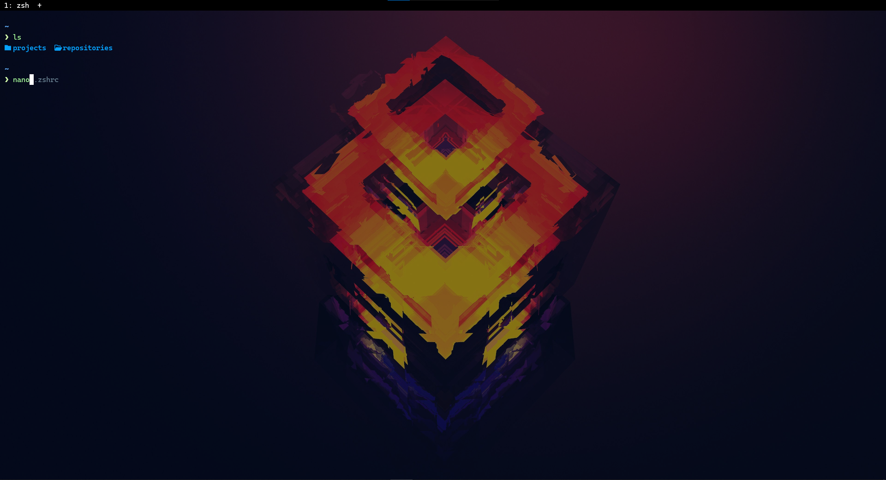

# MB dotfiles (WSL) ⚙️

This repository contains my configuration files for my terminal & shell of choice.

- [.zshrc](https://github.com/matiasbacelar98/mb-dotfiles/blob/main/zsh/.zshrc) (zsh configuration)
- [starship.toml](https://github.com/matiasbacelar98/mb-dotfiles/blob/main/starship/starship.toml) (customizable shell prompt)
- [wezterm.lua](https://github.com/matiasbacelar98/mb-dotfiles/blob/main/wezterm/wezterm.lua) (terminal)

## Requirements

- I use WSL (ubuntu), so there are some configurations that only works in this environment, also i like to keep some config in windows, i only have everything related to my shell in WSL.
- Nerd Font (it's for the icons) in my case i use [Cascadia Code](https://www.programmingfonts.org/#cascadia-code)

## Links

- [Wezterm](https://wezterm.org/)
- [Starship](https://starship.rs/)
- [ZSH Autosuggestions](https://github.com/zsh-users/zsh-autosuggestions)
- [ZSH Syntax Highlighting](https://github.com/zsh-users/zsh-syntax-highlighting)
- [ZSH Eza](https://github.com/z-shell/zsh-eza)

## Screenshots

